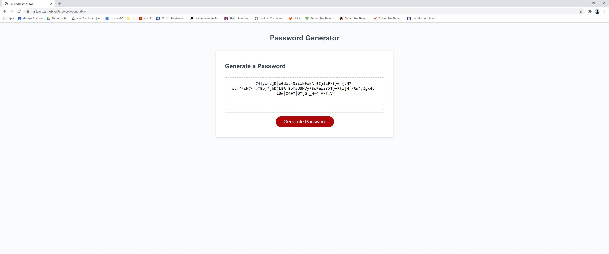

# Password-Generator   
   
Created a website that upon clicking "Generator Passord", prompts the user to:   
   
1. Input the desired password length   
2. Confirm if the user wants lower case letters in their password   
3. Confirm if the user wants upper case letters in their password    
4. Confirm if the user wants numbers in their password     
5. Confirm if the user wants special characters in their password   
   
If the user selects "OK" to the confirm prompts, the script will add those characters into an empty array. After all the confirms, the script will then randomly select from the array and push the selection into another empty array in which the final password is stored. Once the script has randomly selected until the desired password length, the document will update the text to contain the randomly generated password. 
   
Screenshot:    
    
   
Link: 
https://nartexyu.github.io/Password-Generator/
